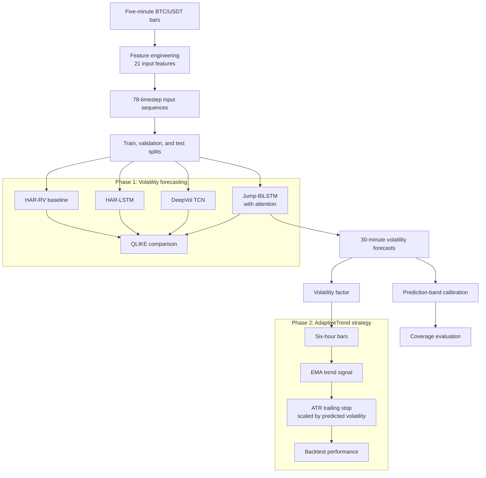
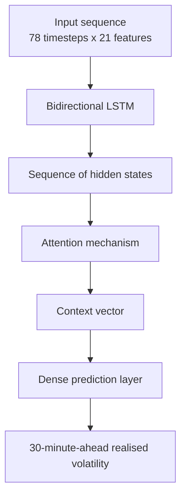

# Forecasting BTC Volatility and Using It in a Trading Strategy

This repository contains the notebooks and supporting material for a project completed during the IITG.ai Summer Research Programme 2026.

The project started with a straightforward question: 
Can a deep-learning model forecast Bitcoin's volatility over the next 30 minutes more accurately than the established HAR-RV model?

The second question was more practical: 
Can those forecasts improve risk management in a trading strategy?

The forecasting results were strong. The trading results are promising, but they are based on a short test period and should be treated as an initial study rather than a finished trading system.

## Results at a Glance

The best model was a jump-aware bidirectional LSTM with attention. It reduced QLIKE by 56.7% compared with the HAR-RV baseline. Its forecasts were then used to scale the trailing stop in a trend-following strategy.

On the held-out January-June 2026 test period, the strategy returned 33.24%, while buy-and-hold returned -35.79%.

| Metric | Result |
| --- | ---: |
| Best model | Jump-BiLSTM with attention |
| Best model QLIKE | 0.4319 |
| HAR-RV baseline QLIKE | 0.9900 |
| QLIKE reduction | 56.7% |
| Prediction-band coverage | 89.9% (target: 90%) |
| Strategy Sharpe ratio | 1.838 |
| Buy-and-hold Sharpe ratio | -1.935 |
| Strategy return | 33.24% |
| Buy-and-hold return | -35.79% |
| Strategy maximum drawdown | -20.68% |
| Buy-and-hold maximum drawdown | -42.21% |
| Number of trades | 16 |
| Approximate average holding period | 11 days |
| Estimated fees on a $10,000 account | About $50 |

These figures come from six months of test data and 16 trades. The bootstrap 95% confidence interval for the strategy's Sharpe ratio was [-1.109, 4.639], which includes zero. A longer walk-forward test across different market conditions is needed before treating the result as evidence of a durable trading edge.

## Repository Contents

```text
notebooks/
  z2-all-models-comparison.ipynb   Volatility-model training and comparison
  z4-adaptive-trend-btc-vol.ipynb  AdaptiveTrend strategy backtest

presentation/
  Presentation.pdf                  Final project presentation

results/
  __results.png                     Results summary image
```

## Research Workflow



## Phase 1: Volatility Forecasting

The first phase predicts realised volatility 30 minutes ahead using five-minute BTC/USDT bars downloaded from KuCoin through CCXT.

| Split | Period |
| --- | --- |
| Training | January 2023-June 2025 |
| Validation | July-December 2025 |
| Test | January-June 2026 |

The dataset contains 368,333 bars. Each model input is a sequence of 78 timesteps with 21 features per timestep. The features include:

- HAR-RV lags, following Corsi (2009)
- Continuous and positive/negative jump components
- ETH cross-asset volatility
- The Deribit DVOL implied-volatility index
- Intraday seasonality features
- News sentiment scores generated with FinBERT

QLIKE was used as the evaluation metric because it is commonly used for volatility forecasting and penalises underestimating volatility more heavily than overestimating it.

### Model Comparison

| Model | QLIKE | QLIKE reduction vs. HAR-RV |
| --- | ---: | ---: |
| HAR-RV | 0.9900 | Baseline |
| HAR-LSTM | 0.4689 | 52.6% |
| DeepVol TCN | 0.4661 | 53.1% |
| **Jump-BiLSTM with attention** | **0.4319** | **56.7%** |

The neural models ended up closer together than expected despite using different architectures. This suggests that the feature set may be doing more of the work than model capacity. The Jump-BiLSTM still performed best, likely because it combines explicit jump features with attention over the full input window.

### Best Model Architecture



News sentiment changed QLIKE by less than 0.5%. This is effectively a null result for this dataset, where 99.7% of five-minute bars contained no news. The feature may still be useful with a denser and more carefully aligned news source.

For the prediction bands, a calibration multiplier of `k = 2.15` produced 89.9% coverage on the test set, close to the 90% target.

## Phase 2: AdaptiveTrend Strategy

The second phase tests whether the volatility forecasts can improve a trend-following strategy's risk management. The strategy operates on six-hour bars aggregated from the five-minute data.

The trading rules are deliberately simple:

- Go long when price is above the EMA and short when price is below it.
- Stay in the position until the trailing stop is hit.
- Move the stop only in the direction of a profitable trade; never widen it.
- Give trades more room when predicted volatility is high and tighten the stop when predicted volatility is low.

The stop distance is calculated as:

```text
stop_distance = k * ATR(14) * vol_factor
vol_factor    = predicted_volatility / median_training_predicted_volatility
```

The strategy parameter `k = 4.0` was selected on the validation set and fixed before the test period. This is separate from the `k = 2.15` calibration multiplier used for the prediction bands.

### Approaches That Did Not Work

Two alternative strategies were tested first:

| Strategy | Outcome | Likely explanation |
| --- | --- | --- |
| VWAP mean reversion | Positive in 0 of 6 walk-forward months | The validation period was range-bound, while the test period was strongly trending. |
| Moreira-Muir volatility scaling | Underperformed buy-and-hold | The usual volatility-return relationship appeared to be inverted in this crypto sample. |

### Test-Period Performance

During the test period, BTC fell from approximately $109,000 to $73,000. The strategy was able to benefit from that downtrend through its short positions.

| Metric | AdaptiveTrend | Buy and hold |
| --- | ---: | ---: |
| Bar-level Sharpe ratio | **1.838** | -1.935 |
| Total return | **33.24%** | -35.79% |
| Maximum drawdown | **-20.68%** | -42.21% |
| Months outperforming buy and hold | **5 of 6** | - |

The result is encouraging, but the sample is too small to support a strong claim. The next useful test would be a 24-36 month walk-forward evaluation covering rising, falling, and range-bound markets.

## Data and Model Weights

The large data files, predictions, and model weights are not included in this repository. They are hosted separately on Kaggle because of their size and GitHub's file limits.

| File | Description |
| --- | --- |
| `merged_5min.parquet` | OHLCV data and engineered features |
| `bilstm_5min_best.pt` | Weights for the best model |
| `predictions_5min.npz` | Saved predicted-volatility arrays |

## Running the Notebooks

The notebooks are the main research artifacts:

1. Download the data, model weights, and prediction files listed above from Kaggle.
2. Update the file paths in the notebooks. The current paths are environment-specific.
3. Run [`z2-all-models-comparison.ipynb`](notebooks/z2-all-models-comparison.ipynb) for the forecasting experiments.
4. Run [`z4-adaptive-trend-btc-vol.ipynb`](notebooks/z4-adaptive-trend-btc-vol.ipynb) for the strategy backtest.

The analysis uses Python 3.10 with PyTorch, NumPy, Pandas, scikit-learn, CCXT, and Matplotlib.

## References

1. Andersen et al. (2003), *Realized Volatility from High-Frequency Returns*.
2. Corsi (2009), *A Simple Approximate Long-Memory Model of Realized Volatility*.
3. Barndorff-Nielsen and Shephard (2004), *Power and Bipower Variation with Stochastic Volatility and Jumps*.
4. Zhang et al. (2024), JFEC, on BiLSTM models and ETH cross-asset features.
5. Moreno-Pino and Zohren (2024), *DeepVol: A Deep Learning Volatility Model*.
6. Moreira and Muir (2017), *Volatility-Managed Portfolios*.
7. Duc Bui (2026), *AdaptiveTrend*, arXiv:2602.11708.

